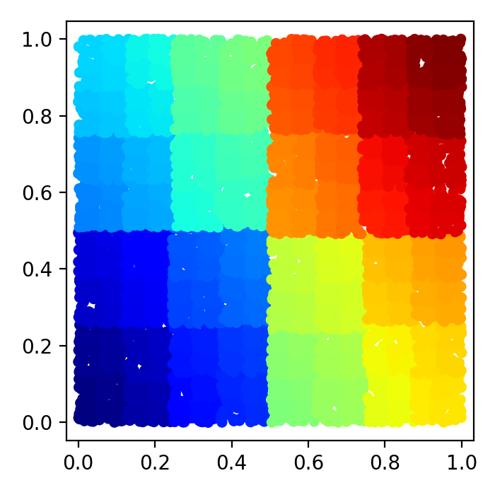
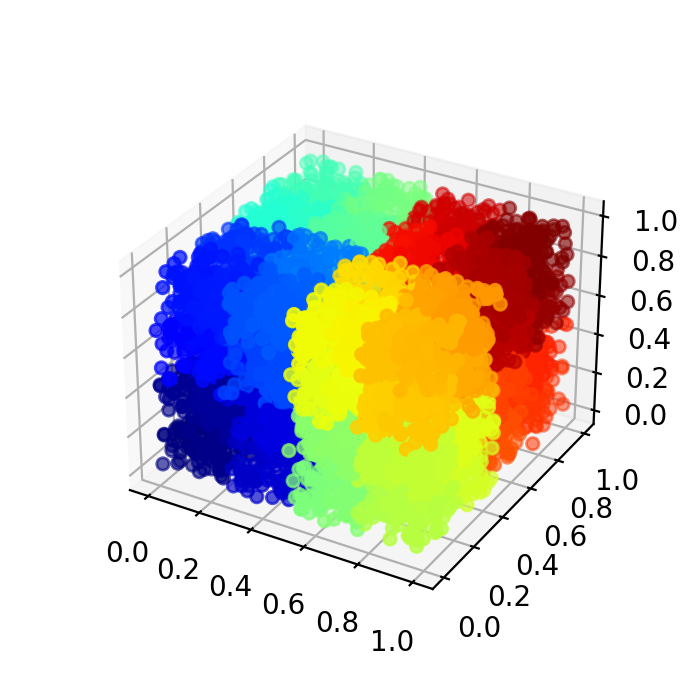

# Despace

## Introduction

Hierarchical spatial decomposition has been shown to be super useful in many geometric problems like geological analysis and N-body simulations. The general goal is to index multi-dimensional data points while keeping spatially proximal points as close as possible. Traditionally, `k-D` trees and space filling curves (Hilbert/Peano and Morton curves) are constructed to divide the `k` dimensional space first. For `k-D` trees, every data point will be assigned to the tree leaves and leaves close to each other in the tree structure are also spatially close to each other. For space filling curves, each data point in the space is assigned to the nearest space filling curve vertex. The whole data set can therefore be sorted along the space filling curve direction.

Constructing and traversing the `k-D` trees and `k`-dimensional space filling curves can be annoying in some certain cases. Here I am instead trying to use a simple sorting scheme to index or sort `k` dimensional data so that close data points are stored closely in the final data structure.

## Algorithm

1. Sort the entire data points in the first dimension.
2. Divide the data into two halves and sort each half in the second dimension.
3. For each sorted half data, divide it into two halves and sort it in the third dimension.
4. Continue the above procedure by circulating the dimension indices until dividing into single data points.
5. Reconstruct the whole data set with the above pseudo-sorted data

## Current status

`k-D` cases are primarily done. Visualization for 2D and 3D cases is supported. Below shows a plot of `N=10000` points in a 2D square space and 3D cube. The data points are blue-->red colored according to their indices from 0 to 9999.



## Try it out

You can play with the python script like changing the number of data points.

```
python sort_coordinates.py 20 2 # use 20 data points for 2D.
```

And we get a figure like below:

